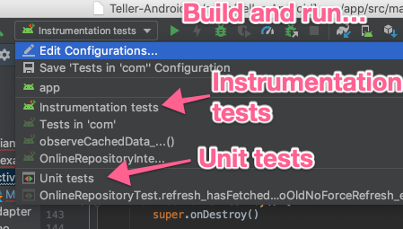

# Building Teller 

Welcome! It's good to have you here. Thank you for wanting to help make Teller even better by contributing. 

Follow these steps to prepare your machine for development. 

* Install development tools.

You will need to have Ruby installed on your machine to run some of the development tools. An easy way to do this is by [installing rbenv on your machine](https://github.com/rbenv/rbenv#installation) and then running the command:

```
$> cd Teller-Android/
$> rbenv install
```

Which will install the Ruby version suggested by Teller. After you install ruby, [install Bundler](https://bundler.io/), then run the following bundler commands: 

```
$> cd Teller-Android/ 
$> bundle install
$> bundle exec overcommit --install
```

This will install a couple development tools for you to use. One of them being [overcommit](https://github.com/brigade/overcommit) git hooks. git hooks are code that runs when you run git commands. These commands that are run can be found and configured in the `.overcommit.yml` file in the Teller project. 

* Get the library building. 

The Teller project is an Android Studio project. You should be able to open the project no problem like you would any other Android Studio project with `File > Open`. 

## Run tests

Teller comes with a unit test and Android instrumentation test suite. When you contribute to Teller, you are required to add, modify, delete tests. 

To build and run tests, use the 2 shared run configurations in Android Studio. 



## How to build the documentation website 

To build the website, you need to install [Nodejs on your machine](https://nodejs.org/en/download/). This gives you the `npm` command line program for you to use. 

After you install Nodejs, run the commands: 

```
$> npm install
$> npm run docs:serve
```

## How to build the Javadocs? 

```kotlin
$> ./gradlew dokka
```

The files are outputted into `docs/javadoc/`

## Any questions? 

All communication for Teller is done via the GitHub repo. If you have a question or get stuck on something [ask a question by creating a new GitHub issue](https://github.com/levibostian/Teller-Android/issues/new). 